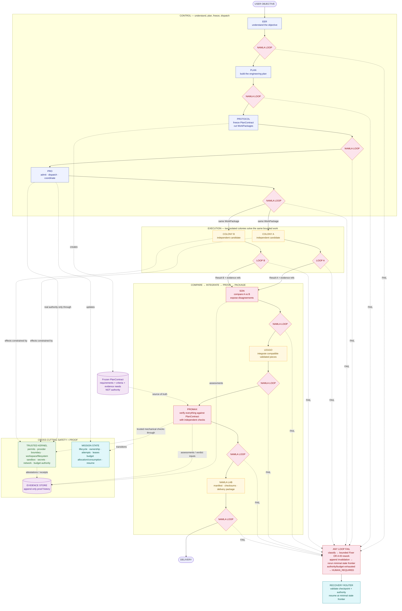

# NAMLA PRO V2

**NAMLA PRO V2 is a governed multi-agent software-engineering runtime.** A mission is converted into a frozen contract, dispatched to two isolated colonies, compared, integrated, verified against the contract, and packaged for delivery. Every important transition passes through the same bounded verification protocol: **NAMLA LOOP**. Real effects are never granted by agents or prompts; they are admitted only through one **Trusted Kernel**.

## How NAMLA PRO works — 30-second architecture map

### Read the diagram literally

1. **EER** interprets the request. **PLAN** creates the draft engineering plan.
2. **PROTOCOL** is the first point where the canonical **PlanContract** exists: it validates, version-binds, freezes it, and cuts bounded WorkPackages.
3. **PRO** is the sole canonical dispatcher. It sends the same bounded package to **COLONY A** and **COLONY B**.
4. A and B work independently. Neither may see the other's candidate before **SON**.
5. **SON** compares; agreement is only a signal, never proof. **LEGGO** integrates compatible validated pieces.
6. **PROMAX** performs the strongest contract-wide verification, including independent checks not solely generated by A/B.
7. **NAMLA LAB** packages the accepted result, evidence manifest, and checksums. It does not silently fix engineering failures.
8. Every major transition crosses **NAMLA LOOP**. FAIL never means "retry forever": classify, repair/rework within budget, invalidate stale evidence, rerun the minimal stale verification frontier, or stop at **HUMAN_REQUIRED**.
9. The **Trusted Kernel** is the only authority plane. Every stage that needs a real effect (provider/process, filesystem/workspace, sandboxed verification, network-capable action, or protected packaging write) must pass through it. Claude/Codex are cognition providers, not authorities.
10. **EvidenceStore is append-only history. Mission state is separate mutable orchestration state.**

## The one canonical mission pipeline

`EER → LOOP → PLAN → LOOP → PROTOCOL → LOOP → PRO → LOOP → (COLONY A → LOOP ∥ COLONY B → LOOP) → SON → LOOP → LEGGO → LOOP → PROMAX → LOOP → NAMLA LAB → LOOP → DELIVERY`

There is no second V2 runtime. Legacy `simulation`, `colony`, `colonyMission`, `digital`, `civilization`, `twin`, `academy`, and related paths are **CURRENT implementation families to census and migrate**, not new V2 kingdoms.

## Six architectural planes

| Plane | Owns | Must not own |
|---|---|---|
| **Control** | intent, plan draft, contract freeze, dispatch | real authority |
| **Execution** | bounded engineering work and integration | self-granted capability |
| **Verification** | gates, comparison, contract checks | mutable mission state |
| **Trust / Authority** | permits, sandbox, filesystem, provider/process boundaries, secrets, budget ceilings/admission authority | semantic product truth |
| **Evidence** | append-only claims, attestations, assessments, verdicts, invalidations | current runtime ownership/state |
| **Mission State** | lifecycle, ownership, attempts, leases, current budget allocation/consumption, resume | historical proof store |

## Authority rule

A PlanContract defines **scope**, never power.

`EffectiveAuthority = HardSecurityPolicy ∩ HumanOrBuildLawAuthorization ∩ TrustedKernelPermit ∩ PlanContractCapabilityScope ∩ RuntimeBudget ∩ EnvironmentCapability`

If any term denies an action, the result is **DENY**.

## Assurance profiles — selective independence, not "two empires everywhere"

| Profile | Meaning | Baseline examples |
|---|---|---|
| `STANDARD` | one canonical implementation + normal independent verification | Protocol, Pro, Lab |
| `HIGH` | add a materially independent critic / alternative method where useful | EER, Plan, Son, sometimes Leggo |
| `CRITICAL` | genuine N-version / dual independent assurance | Colony A/B by architecture, ProMax |

Running identical code twice is not independent assurance.

## Current implementation vs V2

The repository today contains multiple runtime/orchestration families. V2 consolidates them through a **strangler migration**, not a rewrite:

**RESCUE → EXTRACT → REPLACE → VERIFY → REMOVE**

The current `ColonyEngine` still depends on `src/simulation/colonySimulation.ts`, and `src/colony/` is a separate substantial family. No directory is marked disposable by name alone.

See [00 · Current vs Target](./docs/00-current-vs-target.md).

## Documentation map

| # | Document | Purpose |
|---:|---|---|
| 00 | [Current vs Target](./docs/00-current-vs-target.md) | factual CURRENT map vs TARGET V2 |
| 01 | [V2 Overview](./docs/01-namla-v2-overview.md) | components and six planes |
| 02 | [Canonical Pipeline](./docs/02-canonical-pipeline.md) | one mission flow with every gate |
| 03 | [Governance](./docs/03-governance-model.md) | ownership and DONE law |
| 04 | [PlanContract](./docs/04-plan-contract.md) | chronology, freeze, scope-not-authority |
| 05 | [NAMLA LOOP](./docs/05-namla-loop.md) | reusable gate contract |
| 06 | [Failure & Recovery](./docs/06-failure-recovery.md) | Fixer, A/B rework, replan, human |
| 07 | [Evidence Model](./docs/07-evidence-model.md) | Claim / Attestation / Assessment / GateVerdict |
| 08 | [Trusted Kernel](./docs/08-trusted-kernel.md) | one security authority plane |
| 09 | [Kingdom Contracts](./docs/09-kingdom-contracts.md) | StageContext and ownership |
| 10 | [Colony A/B](./docs/10-colony-ab-model.md) | hard isolation and diversity |
| 11 | [Son · Leggo · ProMax](./docs/11-son-leggo-promax.md) | distinct responsibilities |
| 12 | [Namla Lab](./docs/12-namla-lab.md) | packaging only |
| 13 | [Rescue Matrix](./docs/13-rescue-matrix-spec.md) | KEEP / EXTRACT / REWRITE / ARCHIVE / REMOVE |
| 14 | [Migration](./docs/14-migration-strategy.md) | capability-by-capability strangler |
| 15 | [First Sprint](./docs/15-first-sprint.md) | Rescue Census; zero production deletion |
| 16 | [Security Boundaries](./docs/16-security-boundaries.md) | current security capital mapped to target |
| 17 | [Testing Strategy](./docs/17-testing-strategy.md) | baseline, parity, security regression |
| 18 | [Observability](./docs/18-observability-and-metrics.md) | metrics without false quality gates |
| 19 | [Build Law Migration Draft](./docs/19-build-law-migration-draft.md) | proposal only; Build Law unchanged |
| 20 | [Long-Horizon Roadmap](./docs/20-long-horizon-roadmap-draft.md) | non-binding future draft |
| 21 | [Authority & Trust](./docs/21-authority-and-trust-model.md) | EffectiveAuthority and trust rules |
| 22 | [Independence](./docs/22-independence-and-correlated-failure.md) | correlated-failure controls |
| 23 | [Concurrency & Work Scope](./docs/23-concurrency-and-work-scope.md) | access modes and barriers |
| 24 | [Budgets & Anti-Livelock](./docs/24-mission-budgets-and-anti-livelock.md) | hierarchy, reallocation, oscillation |
| 25 | [Replay & Threat Model](./docs/25-replay-environment-and-threat-model.md) | reproducibility classes and threats |
| 26 | [Assurance Profiles](./docs/26-assurance-profiles.md) | STANDARD / HIGH / CRITICAL |
| 27 | [Mission State](./docs/27-mission-state-model.md) | Mission + WorkPackage state machines |
| 28 | [Artifact & Environment Identity](./docs/28-artifact-and-environment-identity.md) | immutable evidence bindings |
| 29 | [Architecture Readiness Gate](./docs/29-architecture-readiness.md) | exact gate before Rescue Census |

## Build Law note

`NAMLA_BUILD_LAW.md` remains authoritative and unchanged by this package. This architecture package proposes future migration rules but does not grant itself new execution, deletion, Git, package-installation, network, or filesystem authority.

## Implementation start condition

If [29 · Architecture Readiness Gate](./docs/29-architecture-readiness.md) has no P0/P1 blocker, the next milestone is **Repository Rescue Census**, not a rewrite and not bulk deletion.
