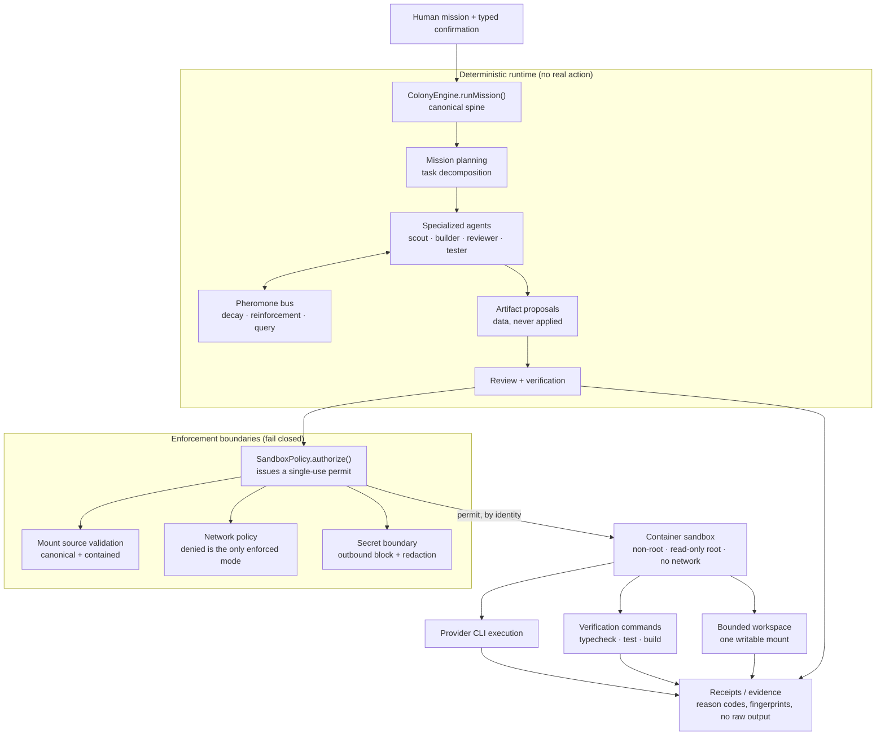

# Namla Pro

An experimental multi-agent system for software engineering, in which many specialized AI workers coordinate on a mission while every action they can take remains bounded, reviewable and fail-closed.

Namla Pro studies one engineering question: **how do you let a colony of autonomous agents write and verify software without giving any of them unbounded authority over the host machine?** The coordination model is borrowed from ant colonies — decentralized agents, local information, indirect signalling — because that class of system solves task allocation without a central controller that must be trusted with everything. The safety model is the opposite of decentralized: every real action funnels through a small number of enforcement boundaries that refuse by default and record what they refused.

The repository contains both halves: a deterministic multi-agent runtime that can be run and reproduced offline, and a set of security boundaries that have been tested individually and on a three-OS CI matrix.

**Status: experimental research prototype (alpha).** Not production software. See [Limitations](#limitations-and-current-research-status).

📖 [Project overview](./docs/PROJECT_OVERVIEW.md) · 🔬 [Reviewer demo (5 min)](./docs/DEMO.md) · 🏗 [Architecture](./docs/architecture.md) · 🔒 [Safety invariants](./SAFETY_INVARIANTS.md) · 🗺 [Roadmap](./docs/roadmap.md)

---

## Quick start

Requires Node 20+. No credentials, no network, no container runtime.

```bash
npm install
npm run typecheck     # strict TypeScript, 0 errors
npm run build
npm run demo          # the reviewer demonstration
npm run test:p0       # the security suite
```

`npm run demo` runs a mission through the colony runtime and then shows five independent security boundaries each refusing an unsafe request. It starts no process, opens no socket, and needs no credential. A walkthrough of what to look for is in [docs/DEMO.md](./docs/DEMO.md).

---

## What Namla Pro demonstrates

Each item below is implemented and exercised by a runnable demo or test; the [status table](#implementation-status) names the evidence.

- **Deterministic multi-agent coordination** — a mission is decomposed into tasks and worked by specialized agents over discrete ticks, reproducibly.
- **Stigmergic signalling** — agents coordinate through a shared, decaying, reinforceable signal space rather than direct messaging.
- **Persistent specialized workers** — agents carry identity, role, trust level and accumulated skill across missions.
- **Proposal → review → verification pipeline** — generated code is data that must be reviewed and verified before anything is applied; nothing self-applies.
- **Evidence logging** — every attempt, including every refusal, produces a receipt carrying reason codes and fingerprints rather than raw output.
- **Differential verification (Twin Empire)** — two isolated colonies solve the same objective independently, their evidence bundles are frozen and cross-examined, and a court decides on evidence; a witness detects cross-colony leakage and fabricated test evidence.
- **Enforced trust boundaries** — workspace containment, an outbound provider boundary, a sandbox permit gate, and container isolation verification, each of which fails closed.

---

## Architecture



The deterministic runtime performs no real action at all — it plans, coordinates and produces proposals. Anything that touches the host crosses the enforcement boundary, and if the boundary cannot prove its guarantees the request is refused rather than downgraded.

### Why an ant colony

The analogy is a design choice, not decoration. Ant colonies allocate work across many simple agents with no agent holding a global plan, coordinating **stigmergically** — by modifying a shared environment (pheromone trails) rather than messaging each other. Three properties matter here:

1. **Local information.** An agent decides from what it can currently sense, so agents can be added or removed without reconfiguring a scheduler.
2. **Indirect coordination.** Signals decay, so stale coordination fades automatically instead of requiring explicit cleanup.
3. **No critical individual.** Work reallocates when an agent fails.

Namla Pro implements this literally: `src/pheromones/` and `src/core/pheromoneBus.ts` provide a signal space with decay, reinforcement and query, and agents read and write it during a mission. The trade-off is deliberate — decentralized *coordination*, strictly centralized *authority to act*.

---

## Implementation status

| Subsystem | Status | Real or simulated | Evidence |
|---|---|---|---|
| Colony runtime (`ColonyEngine.runMission`) | Implemented | Deterministic simulation — no real action | `src/engine/colonyEngine.ts`; `npm run demo`; 41 demos in the golden harness |
| Stigmergic signalling | Implemented | Deterministic simulation | `src/pheromones/`, `src/core/pheromoneBus.ts`; `demoPheromoneFlow` |
| Mission planning / task decomposition | Implemented | Deterministic simulation | `src/planner/`, `demoMissionPlanning` |
| Proposal → review → verification | Implemented | Data only; nothing self-applies | `src/generation/`, `src/review/`, `demoReviewLoop` |
| Receipt / evidence log | Implemented | Real in-memory records | `src/core/receiptLog.ts`, `demoReceiptStatusSemantics` |
| Twin Empire differential verification | Implemented | Deterministic simulation; providers not connected | `src/twin/`, `demoNamolaTwinEmpireV1` (reports `realProviderCalls: 0`) |
| Workspace containment | Implemented / enforced | Real filesystem checks | `src/cognitive/safeWorkspacePath.ts`; `workspaceSecurityTests` (27) |
| Project-file creation boundary | Implemented / fail-closed | Real boundary; real writer installed but inactive | `src/application/projectFileCreator.ts`; `createTargetBindingTests` (14) |
| Outbound provider boundary (secrets) | Implemented / fail-closed | Real | `src/cognitive/safeProviderRequest.ts`; `providerRequestContainmentTests` (18) |
| Environment secret registry | Implemented | Real | `src/cognitive/environmentSecretBootstrap.ts`; `environmentSecretBootstrapTests` (20) |
| Sandbox permit gate | Implemented / fail-closed | Real | `src/cognitive/sandboxPolicy.ts`; `sandboxPolicyTests` (25) |
| Container isolation (Docker backend) | Implemented / verified in CI | Real containers in CI only | `src/cognitive/containerSandboxBackend.ts`; `real-container-sandbox` CI job |
| Network policy enforcement | Implemented / partially supported | Real; only `denied` is enforceable | `src/cognitive/verificationSandbox.ts`; `containerSandboxTests` (66) |
| Verification execution routing | Implemented / fail-closed | Real routing; unavailable without a verified sandbox | `src/cognitive/nodeProviderProcessDriver.ts`; `verificationSandboxTests` (21) |
| Provider CLI execution | Implemented / gated | Real; requires human confirmation + permit | `src/cognitive/realProviderActivation.ts` |
| Live Twin / live objective operations | Implemented / not demonstrated here | Real; excluded from the demo path | `src/cli/twinEmpireLiveCli.ts` |
| Robot / desktop bodies | Planned | Simulated planning data only | `src/bodies/`, `docs/bot-desktop-model.md` |

---

## Security status

This section states only what there is evidence for. The word "secure" is deliberately not used.

### Verified by tests and CI

`.github/workflows/p0-security.yml` runs the suite on `ubuntu-latest`, `windows-latest` and `macos-latest`. Locally the gate reports **398 passed, 0 failed, 3 skipped** across 20 suites.

- **Workspace containment** — junction and symlink escape (nested and doubly nested), prefix collision, case semantics, read/delete/rename escape, TOCTOU revalidation before every mutation.
- **Bind-mount source validation** — every path handed to Docker is canonicalized, proven contained in a separately configured root, and refused if it is a symlink, traversal, or carries characters that would inject extra mount options.
- **Network policy truthfulness** — `denied` maps to `--network none`; `loopback-only`, `provider-only` and `allowlisted` are refused as unenforceable rather than silently widened to a Docker bridge.
- **Create-target binding** — the file a create attempt opens is derived from the approved relative path and proven against the inspection fingerprint before the grant is consumed.
- **Secret handling** — credentials block an outbound request rather than being redacted and sent; registered environment credential values are scrubbed from receipts and summaries.
- **Verification routing** — verification commands execute only through a sandbox permit; there is no host execution path in that function.
- **Container isolation** — a probe running *inside* a real container confirmed non-root identity, hidden host root, absent Docker socket, no inherited secrets, private PID/IPC namespaces, read-only root filesystem, refused writes outside the workspace, read-only source mounts, denied network, and enforced CPU/memory/PID limits. The ubuntu CI leg reported `capabilityState: available-and-verified`. The check is the *Real container sandbox (isolation verification)* job in `.github/workflows/p0-security.yml`, driven by `src/tools/verifyContainerSandbox.ts` and `src/tools/containerIsolationProbe.ts`.

Skips are treated as failures on the POSIX legs, so a platform-limited test cannot silently disappear. The three local skips are Windows file-symlink privilege limitations and do run on Linux and macOS.

### Implemented but not proven here

- Container isolation is verified **in CI**, not on an arbitrary developer machine. Without Docker, `detectContainerRuntime()` reports `unavailable` and high-risk execution refuses.
- Detection is never verification: a resolvable `docker --version` yields at most `available-unverified`, which does not authorize execution.

### Fail-closed by design

- High-risk execution (`npm test`, a build, any package script — all of which can run project-controlled code) requires `available-and-verified`. Without it the runtime refuses before any process is created. **There is no host fallback**, because a silent fallback is worse than an error: the caller would believe it was sandboxed.
- `provider-only` networking is currently unenforceable, so real provider execution under the sandbox is refused. This is an honest consequence of not letting an unrestricted bridge stand in for an allowlist.

---

## Repository layout

```
src/engine/          Canonical mission runtime (public API)
src/core/            Queen, orchestrator, safety guard, receipts, pheromone bus
src/planner/         Mission and task decomposition
src/ants/            Agent roles
src/pheromones/      Stigmergic signal space (decay, reinforcement, query)
src/senses/          Structured perception
src/cognitive/       Trust boundaries: sandbox, secrets, paths, process, provider
src/application/     Approval contracts and the guarded file-creation boundary
src/inspector/       Read-only project inspection
src/colony/          Colony lifecycle, genesis, scaling
src/colonyMission/   Mission execution and cognitive workers
src/civilization/    District/council coordination and MCP execution
src/digital/         Objective runtime, verification, repair
src/twin/            Twin Empire differential verification
src/academy/         Agent training and skill passports
src/cli/             Human-operated entry points
src/examples/        49 runnable demos
src/tools/           Test suites, security gate, reviewer demo
docs/                Architecture and concept documentation
```

Roughly 360 TypeScript files and 66,000 lines. The [project overview](./docs/PROJECT_OVERVIEW.md) is the recommended way in.

---

## Limitations and current research status

Stated plainly, because an honest prototype is more useful than an overstated one.

- **Experimental alpha.** Not production software, not a production autonomous coding platform, and not safe to run live on a machine holding credentials or data you care about.
- **Live provider execution is currently blocked by design.** `provider-only` networking has no enforcement mechanism in this backend, so it fails closed rather than being approximated by unrestricted egress. Enabling it requires a real egress-control mechanism that does not yet exist here.
- **Container image is not digest-pinned.** `IMAGE_DIGEST` is empty and `REQUIRE_PINNED_IMAGE` is false; the image is trusted because CI builds it in the same job. A registry-sourced image would need pinning first.
- **Verification is unavailable outside CI.** No production composition root can currently supply a verified sandbox, so verification commands refuse on a normal developer machine.
- **Architectural debt.** Several subsystems (colony, colonyMission, civilization, digital, twin) contain overlapping orchestration that grew as the project did. `docs/runtime-spine.md` records which path is canonical and which is legacy.
- **Simulation is not evidence about the real world.** The deterministic layer proves coordination logic, not that agents produce good software.
- **Open security findings.** Redaction pattern coverage and heuristic secret detection remain unresolved; see [SAFETY_INVARIANTS.md](./SAFETY_INVARIANTS.md).

---

## Where to read next

| Document | Purpose | Time |
|---|---|---|
| [docs/PROJECT_OVERVIEW.md](./docs/PROJECT_OVERVIEW.md) | Motivation, research question, design, results, limitations | 10–15 min |
| [docs/DEMO.md](./docs/DEMO.md) | Hands-on validation for a reviewer | 5 min |
| [docs/architecture.md](./docs/architecture.md) | Full architecture | 20 min |
| [docs/runtime-spine.md](./docs/runtime-spine.md) | The canonical runtime path, and what is legacy | 10 min |
| [SAFETY_INVARIANTS.md](./SAFETY_INVARIANTS.md) | Every enforced invariant and its proof | reference |
| [NAMLA_BUILD_LAW.md](./NAMLA_BUILD_LAW.md) | The rules every change must obey | reference |
| [docs/roadmap.md](./docs/roadmap.md) | Development history and what remains | reference |

## License

UNLICENSED — research prototype, not distributed for use.
