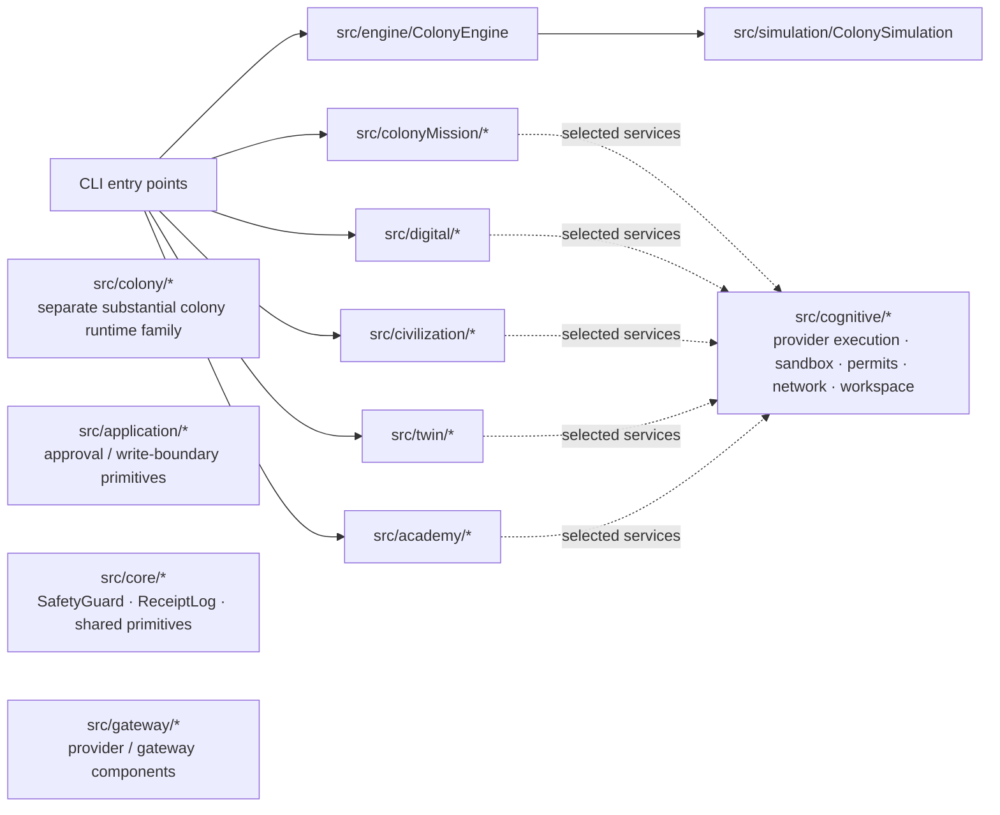
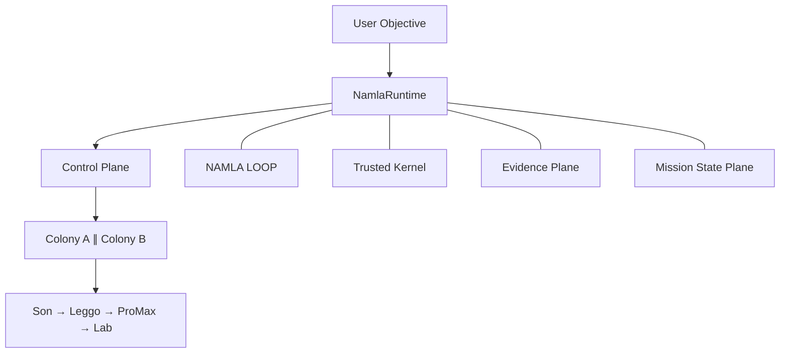

# 00 · Current implementation vs target V2

This document prevents the most dangerous documentation error: describing TARGET architecture as though it is CURRENT code.

## CURRENT — multiple implementation families

The current repository contains several substantial orchestration/runtime families. They are not represented as one import chain unless source evidence proves one.

Important factual constraints:

- `ColonyEngine` currently delegates to `src/simulation/colonySimulation.ts`; therefore `src/simulation/` is not an immediate deletion target.
- `src/colony/` is a separate substantial family with ant intelligence, mind, population, teams, budgets, lifecycle, knowledge, invariants, and related code. It requires a rescue audit.
- `src/cognitive/safeProviderRequest.ts` is the outbound provider-request boundary. `liveProviderExecution.ts` imports and uses it.
- Current CLI/runtime paths do not all pass through `ColonyEngine`.

## TARGET — one runtime

V2 permits extensions and workers, but **not additional top-level runtimes**.

## Migration state

V2 is a target architecture. Migration uses:

`RESCUE → EXTRACT → REPLACE → VERIFY → REMOVE`

A legacy component is removed only after its replacement has dependency proof, required parity proof, security-regression proof, and recorded evidence.
