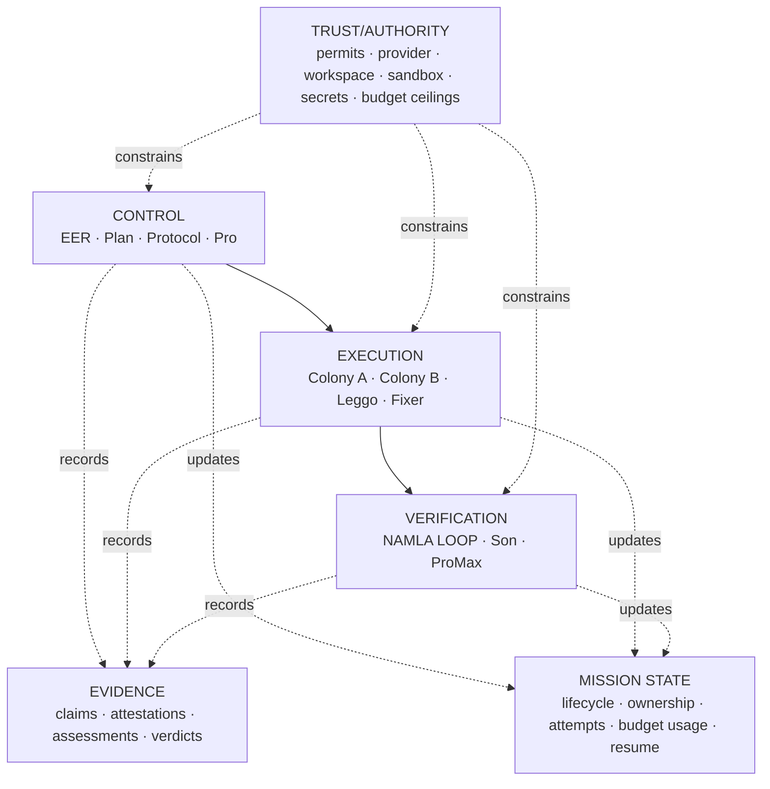

# 01 · NAMLA PRO V2 overview

## Architectural invariant

There is exactly one canonical V2 runtime:

`NamlaRuntime + PlanContract + NAMLA LOOP + Trusted Kernel + six planes`

No feature introduces a second runtime merely because it is large or important.

## Six planes

The Evidence Plane is append-only history. The Mission State Plane is mutable orchestration state. They are intentionally separate.

## Canonical components

- **EER** — intent interpretation and normalization.
- **Plan** — draft decomposition and acceptance strategy.
- **Protocol** — PlanContract validation/freeze + WorkPackage construction.
- **Pro** — sole dispatcher and lifecycle coordinator.
- **Colony A/B** — independent engineering candidates.
- **Son** — cross-colony comparison and disagreement assessment.
- **Leggo** — integration.
- **ProMax** — strongest contract-wide independent verification.
- **Namla Lab** — packaging and delivery readiness.
- **NAMLA LOOP** — one gate protocol around every significant transition.
- **Trusted Kernel** — one authority boundary for real effects.
- **EvidenceStore** — append-only proof history.
- **MissionStateStore** — versioned current mission and `WorkPackageExecution` lifecycle/ownership plus allocated/consumed budget state; it does not grant or enlarge authority.

## Non-goals

V2 is not optimized for minimum LOC, maximum agent count, or decorative biological metaphors. Its optimization target is **coherent authority, bounded autonomy, evidence freshness, and safe migration**.
