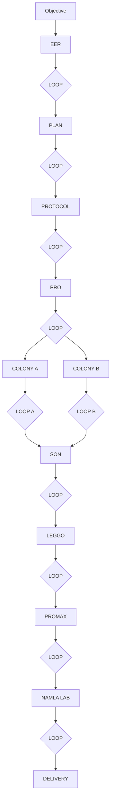

# 02 · Canonical mission pipeline

This is the only top-level V2 mission flow.

## Chronology

1. EER and Plan execute **before** a frozen PlanContract exists.
2. Protocol validates the plan, binds versions/policies, freezes the PlanContract, and creates WorkPackages.
3. Pro owns dispatch. Protocol never dispatches directly.
4. Both colonies execute the same bounded WorkPackage independently.
5. Son receives both results only after their colony-local gates complete.
6. Leggo integrates.
7. ProMax verifies the integrated candidate against the frozen contract and independent checks.
8. Lab packages only an accepted candidate.

## Gate invariant

No major stage transition bypasses NAMLA LOOP.
