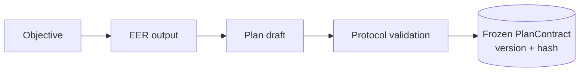

# 04 · PlanContract

## Chronology

EER and Plan produce interpreted intent and a plan draft. **Protocol** is the first stage allowed to freeze the canonical PlanContract.



## Conceptual contract

```ts
interface PlanContract {
  contractId: string;
  version: string;
  objective: string;
  acceptanceCriteria: readonly AcceptanceCriterion[];
  constraints: readonly Constraint[];
  tasks: readonly TaskSpec[];
  dependencies: readonly Dependency[];
  allowedCapabilities: readonly CapabilityScope[];
  requiredTests: readonly TestRequirement[];
  securityRequirements: readonly SecurityRequirement[];
  expectedArtifacts: readonly ArtifactRequirement[];
  evidenceRequirements: readonly EvidenceRequirement[];
  riskClassification: RiskClass;
  completionConditions: readonly CompletionCondition[];
}
```

## Freeze identity

Protocol freezes canonical serialized contract bytes and records a versioned contract identity/hash. Equivalent-looking but differently encoded mutable objects are not treated as the same frozen contract. Any authorized replan produces a new immutable contract version; old evidence remains historical and is revalidated through the dependency graph.

## Immutable source of requirements, not source of authority

`allowedCapabilities[]` is only a scope ceiling.

`EffectiveAuthority = HardSecurityPolicy ∩ HumanOrBuildLawAuthorization ∩ TrustedKernelPermit ∩ PlanContractCapabilityScope ∩ RuntimeBudget ∩ EnvironmentCapability`

A contract entry can restrict authority; it cannot create authority.

## Contract change

A contract modification creates a new version. It never rewrites history. Evidence bound to changed clauses is evaluated by the EvidenceDependencyGraph and becomes stale where required.
