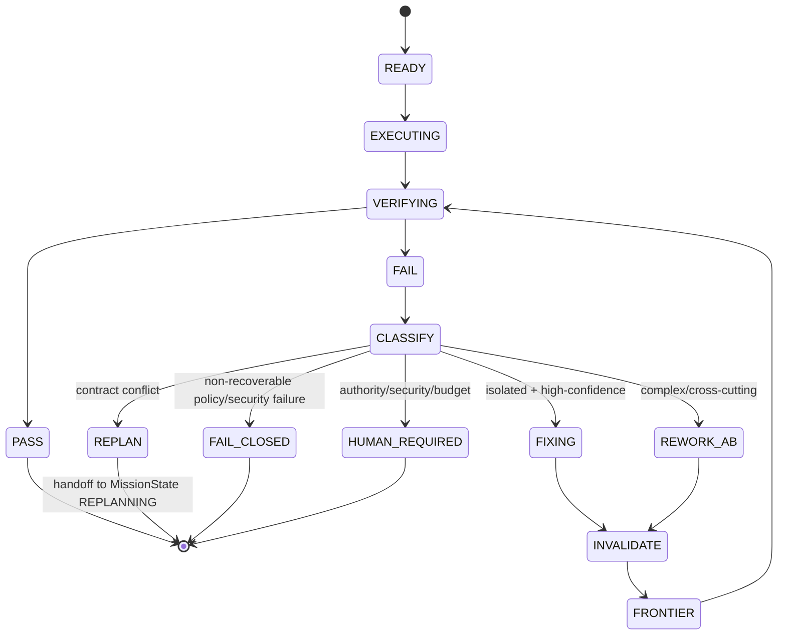

# 05 · NAMLA LOOP

NAMLA LOOP is one reusable verification protocol, not a collection of ad-hoc retries.

## Gate contract

```ts
interface GateInputBase {
  missionId: string;
  workPackageId?: string;
  /** Distinguishes independent A/B executions of the same WorkPackage. */
  workPackageExecutionId?: string;
  stageId: string;
  artifactIdentity: ArtifactIdentity;
  policyVersions: readonly string[];
  environmentIdentity: EnvironmentIdentity;
  requiredAttestations: readonly string[];
  requiredAssessments: readonly string[];
  evidenceRefs: readonly string[];
  budget: LoopBudget;
}

type GateInput =
  | (GateInputBase & {
      phase: "PRE_CONTRACT";
      contractVersion?: never;
    })
  | (GateInputBase & {
      phase: "CONTRACT_BOUND";
      contractVersion: string;
    });

interface VerdictDetails {
  reasonCodes: readonly string[];
  staleEvidenceRefs: readonly string[];
  missingEvidence: readonly string[];
  failedCriteria: readonly string[];
}

type GateVerdict =
  | (VerdictDetails & { status: "PASS"; nextAction: "NEXT" })
  | (VerdictDetails & {
      status: "FAIL";
      nextAction: "FIX" | "REWORK_AB" | "REPLAN" | "FAIL_CLOSED";
    })
  | (VerdictDetails & { status: "HUMAN_REQUIRED"; nextAction: "HUMAN_REQUIRED" });
```

## Pre-contract gates and recovery legality

EER and Plan still produce immutable, hash-bound mission-level artifacts, so their LOOP gates are real gates even though no frozen PlanContract exists yet. For those stages `phase = PRE_CONTRACT`, `contractVersion` is structurally forbidden, and `ArtifactIdentity.workPackageId` is absent; the gate evaluates authoritative mission inputs, schema/policy requirements, and required assessments/attestations. The LOOP after Protocol freeze and every later LOOP use `phase = CONTRACT_BOUND`, where `contractVersion` is structurally mandatory.

The discriminated verdict type makes contradictory states such as `PASS + FIX` unrepresentable. The failure `nextAction` set is protocol-wide, not permission for every action at every stage. A versioned **StageRecoveryPolicy** constrains legal actions. For example, `REWORK_AB` is illegal before A/B WorkPackages exist, and an illegal recovery action fails closed.

## State machine



## Budgets

Every loop is bounded. Child loops cannot exceed parent allocation. A trusted parent may explicitly reallocate remaining budget within the mission ceiling when authority permits and the reason is recorded. Agents/providers cannot self-expand budgets.
