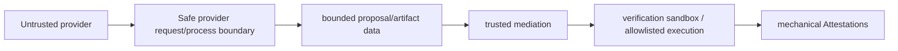

# 08 · Trusted Kernel

There is one Trusted Kernel. No kingdom owns a private security kernel.

## Domains

- authority / permits
- provider request boundary
- provider process boundary
- workspace/path boundary
- filesystem mutation authority
- verification sandbox
- secret handling
- network policy
- process limits
- budget ceilings, admission checks, and authorization of bounded reallocation
- receipts and audit

## Current valuable primitives

Examples of current security capital include `src/cognitive/safeProviderRequest.ts`, provider/process drivers, sandbox/container verification, network policy, workspace safety, permit systems, secret bootstrap/redaction, application approval/write-boundary components, `SafetyGuard`, and `ReceiptLog`.

Migration should extract or wrap these proven primitives rather than rewrite them casually.

## Provider vs sandbox paths

Provider generation and verification sandboxing are distinct controlled paths. Do not claim that current provider networking is fully container-egress-enforced unless implementation evidence proves it.
