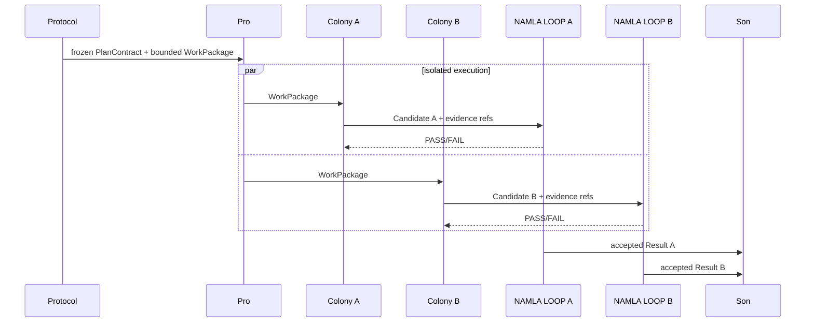

# 10 · Colony A/B model

A/B dual execution is a core V2 invariant for engineering WorkPackages.

## Sequence

## Isolation

Before Son, neither colony receives:
- peer candidate or patch
- peer reasoning
- peer private assessment
- peer-specific evidence that reveals implementation details

Shared contract, policies, failure codes, and safe common diagnostics are allowed.

## Independence declaration

A/B agreement is not proof. Every package records meaningful independence dimensions where available: provider/model, implementation path, test-generation method, evidence source, environment, algorithm/reasoning approach.

## Execution identity

A and B receive the same immutable `WorkPackage.id` but different `WorkPackageExecution.executionId` values. Candidate artifacts, local LOOP evidence, attempts, leases, and budget consumption bind to the execution identity. Son compares two accepted execution outputs; it never collapses them into one mutable package state before comparison.
