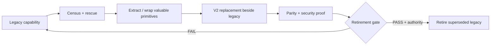

# 14 · Migration strategy — strangler, not rewrite

**RESCUE → EXTRACT → REPLACE → VERIFY → REMOVE**

There is no bulk-deletion phase.

## Sequence

| Step | Purpose |
|---|---|
| R0 | freeze factual baseline: entry points, tests, security results, versions |
| R1 | prepare governance changes as drafts only |
| R2 | Repository Rescue Census + dependency/runtime/security maps |
| R3 | baseline verification evidence |
| R4 | wrap/extract proven Trusted Kernel primitives with parity |
| R5 | create minimal V2 contracts + Mission State + Evidence schemas |
| R6 | create one minimal NamlaRuntime skeleton |
| R7 | add PlanContract + Protocol/Pro ownership |
| R8 | add NAMLA LOOP + evidence invalidation |
| R9 | migrate one bounded capability |
| R10 | prove parity/security/correctness |
| R11 | retire only that superseded capability when legally authorized |

Repeat R9–R11 capability-by-capability.

