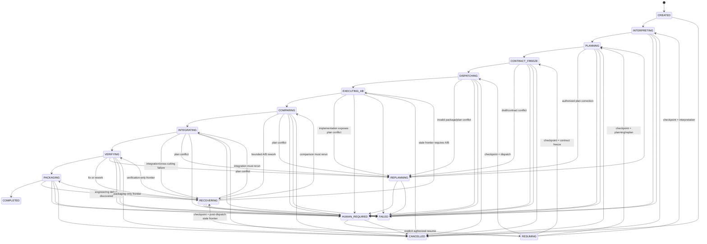
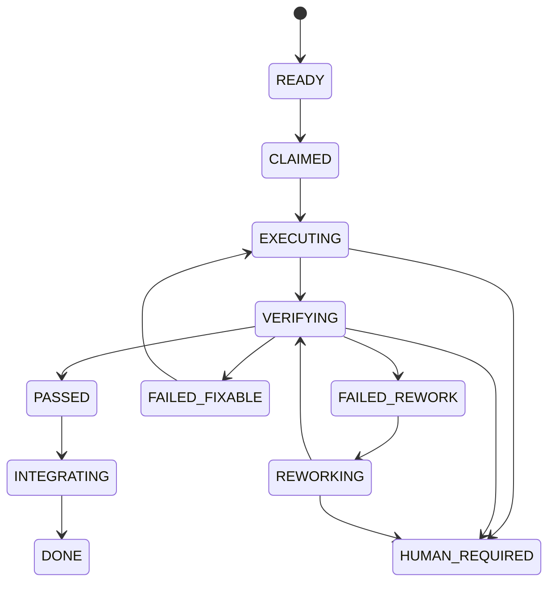

# 27 · Mission and WorkPackage state model

Runtime state is separate from append-only evidence.

## Mission state machine

The happy path is linear, but recovery is **checkpoint-driven**. `HUMAN_REQUIRED` ends the current autonomous run; an explicit authorized resume does not jump to a fixed stage. It re-enters through `RESUMING`, validates the stored resume checkpoint and current authority, then returns to the stage selected by the recovery plan / minimal stale verification frontier.



Illegal transitions fail closed and append transition evidence. A resume checkpoint stores the intended safe re-entry stage plus the artifact/contract/policy identities that must still be current; pre-dispatch checkpoints re-enter their exact validated stage, while post-dispatch recovery uses the minimal stale frontier; it is not a string that can bypass transition validation.

## WorkPackageExecution state machine

```ts
type WorkPackageExecutionState =
  | "READY"
  | "CLAIMED"
  | "EXECUTING"
  | "VERIFYING"
  | "FAILED_FIXABLE"
  | "FAILED_REWORK"
  | "REWORKING"
  | "PASSED"
  | "INTEGRATING"
  | "DONE"
  | "HUMAN_REQUIRED";
```



Each Colony A/B run of the same immutable WorkPackage has its own `WorkPackageExecution` record. Tracked mutable fields include `executionId`, `colonyId`, owner/lease, attempt, budget consumption, ArtifactIdentity refs, evidence refs, and resume checkpoint. The immutable WorkPackage itself has no mutable owner.


## Concurrency-safe state transitions

Mission and execution records carry a monotonically increasing `stateVersion`. Pro (or the trusted runtime coordinator acting for Pro) changes state only through an atomic conditional transition conceptually equivalent to:

```ts
compareAndTransition(recordId, expectedStateVersion, legalTransition)
```

A stale writer, expired/superseded lease, wrong execution identity, or illegal transition is rejected fail-closed and produces transition evidence. Agents/providers never update MissionStateStore directly. Exact persistence/CAS technology is an implementation decision, but the compare-and-transition invariant is architectural.
